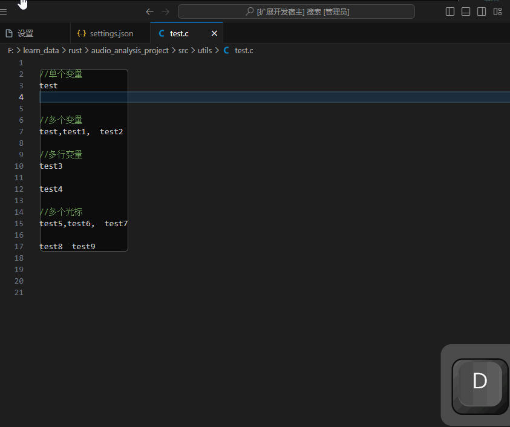

<!--
 * @Author: nicheface nicheface@outlook.com
 * @Date: 2023-09-22 08:47:56
 * @LastEditors: nicheface nicheface@outlook.com
 * @LastEditTime: 2023-09-22 10:05:18
 * @FilePath: \\variable-print\\README EN.md
-->
<!--
 * @Author: nicheface nicheface@outlook.com
 * @Date: 2023-09-22 08:47:56
 * @LastEditors: nicheface nicheface@outlook.com
 * @LastEditTime: 2023-09-22 09:46:08
 * @FilePath: \\variable-print\\README EN.md
-->

# variable-print README

简体中文|[English](./README%20EN.md)

<!--  -->

📕 [GitHub Repository](https://github.com/nicheface/variable-print.git)
📗 [VS Code Marketplace](https://marketplace.visualstudio.com/items?itemName=nicheface.variable-print)
📘 [Changelog](https://github.com/nicheface/variable-print/blob/main/CHANGELOG.md)

📙 The plugin is continuously improving. Feel free to submit [Issues](https://github.com/nicheface/variable-print/issues) or [Pull requests](https://github.com/nicheface/variable-print/pulls)

---
>Variable Print allows custom variable printing in any programming language, with the option to customize it in the extension settings.
It supports printing multiple variables in a single line (comma or space separated), and also supports printing multiple variables across multiple lines. **You can also print multiple selected variables simultaneously by holding down <kbd>alt</kbd>.**

- [variable-print README](#variable-print-readme)
  - [Usage Instructions](#usage-instructions)
    - [Demo](#demo)
  - [Configuration](#configuration)
    - [Customizing Print Statements](#customizing-print-statements)
  - [Changelog](#changelog)

## Usage Instructions

Select the variables you want to print, then use a shortcut key, enter a command, or right-click and choose `variable: Print Selected Variable`.

- Shortcut key for win and mac: <kbd>ctrl</kbd>+<kbd>alt</kbd>+<kbd>p</kbd>
- Command for <kbd>ctrl</kbd>+<kbd>shift</kbd>+<kbd>p</kbd>: `Print Selected Variable`
- Right-click and select `variable: Print Selected Variable`

### Demo

<!--  -->

## Configuration

>*User configuration takes precedence over default configuration*

- `variable-print.userCustomPrintStatements` is for user configuration
- `variable-print.customPrintStatements` is the default configuration

### Customizing Print Statements

- `$v` represents the current variable (automatically splits for multiple variables)
- `$row` represents the current row
- `$col` represents the current column
- Supports the same configuration for multiple suffixes `h|c|cpp`

<!--  -->

## Changelog

- 2023-09-22 2.0.0 Added multi-cursor support, made the insert print statement an asynchronous operation, correctly calculated line and column numbers, added user configuration options, added right-click context menu, added vscode-nls, updated license, and improved readme.
- 2023-09-16 1.0.3 Added more default configurations for different languages and finally completed the release.yml for GitHub Actions.
- 2023-09-15 1.0.2 Added logo and GitHub action.
- 2023-09-15 1.0.1 Improved readme.
- 2023-09-15 1.0.0 Initial version with the ability to customize print format in the extension settings, supports multiple suffixes (c|cpp|h) using the same print configuration.

**Enjoy!**
