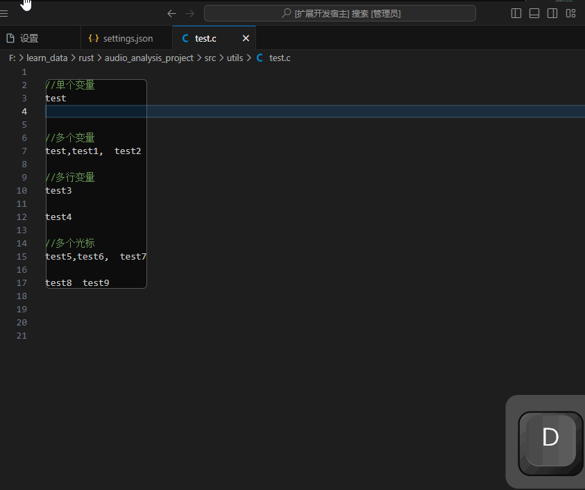
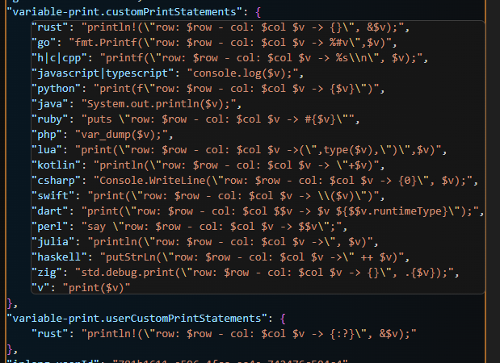

<!--
 * @Author: nicheface nicheface@outlook.com
 * @Date: 2023-09-15 14:29:41
 * @LastEditors: nicheface nicheface@outlook.com
 * @LastEditTime: 2023-09-22 10:50:08
 * @FilePath: \\variable-print\\README.md
-->
<!--
 * @Author: gyg nicheface@outlook.com
 * @Date: 2023-09-15 14:29:41
 * @LastEditors: nicheface nicheface@outlook.com
 * @LastEditTime: 2023-09-22 09:49:13
 * @FilePath: \\variable-print\\README.md
-->
# variable-print

简体中文|[english](./README%20EN.md)

	

📕 [GitHub仓库](https://github.com/nicheface/variable-print.git)
📗 [VS Code插件市场](https://marketplace.visualstudio.com/items?itemName=nicheface.variable-print)
📘 [更新日志](https://github.com/nicheface/variable-print/blob/main/CHANGELOG.md)

📙 插件不断完善，欢迎提交 [Issues](https://github.com/nicheface/variable-print/issues)、[Pull requests](https://github.com/nicheface/variable-print/pulls)

---
>变量打印，自定义任意语言的变量打印，可以在扩展设置里面自定义修改
支持一行内多变量(逗号或者空格隔开)打印，支持多行多变量打印，**支持按住 <kbd>alt</kbd> 多选多个光标同时打印**

- [variable-print](#variable-print)
  - [使用说明](#使用说明)
    - [演示效果](#演示效果)
  - [配置](#配置)
    - [打印语句支持修改](#打印语句支持修改)
  - [更新日志](#更新日志)

## 使用说明

选中要打印的变量，按快捷键或者输入命令或者右击鼠标，选择`variable: 打印选中的变量`

- win,mac 快捷键 <kbd>ctrl</kbd>+<kbd>alt</kbd>+<kbd>p</kbd>
- <kbd>ctrl</kbd>+<kbd>shift</kbd>+<kbd>p</kbd>的命令是`Print Selected Variable`
- 鼠标右键，点击`variable: 打印选中的变量`

### 演示效果

<!--  -->

## 配置

>*用户配置优先级高于默认配置*

- `variable-print.userCustomPrintStatements` 是用户配置
- `variable-print.customPrintStatements` 是默认配置

### 打印语句支持修改

- `$v`代表当前变量(多个变量自动拆分)
- `$row`代表当前行
- `$col`代表当前列
- 支持多个后缀`h|c|cpp`使用同种配置

<!--  -->

## 更新日志

- 2023-09-22 2.0.0 支持多光标，插入打印语句变成了异步操作，正确计算行号和列号，增加了用户配置选项，增加了vscode-nls，增加鼠标右键上下文，修改了license，完善了readme。
- 2023-09-16 1.0.3 增加了更多语言的默认配置并且终于完成了github actions的release.yml编写
- 2023-09-15 1.0.2 加了logo和github action
- 2023-09-15 1.0.1 改进了readme
- 2023-09-15 1.0.0 初始版本 可以自定义打印格式，在扩展设置里修改，支持 c|cpp|h 多个后缀名使用同种打印配置

**Enjoy!**
